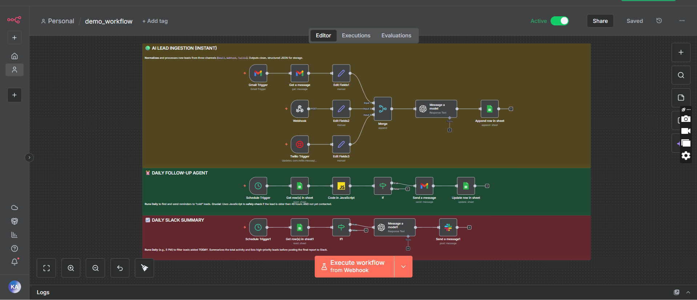

# 🚀 The Omni-Channel CRM Agent (n8n Backend)

**Project Goal:** To fully automate lead capture, qualification, follow-up, and daily management reporting across all sales channels.

---

## ✨ What This Workflow Does

This system is built to replace manual lead handling with intelligent, autonomous actions:

* **Smart Capture:** Instantly captures leads arriving via **WhatsApp, Gmail, and Webhooks**.
* **AI Qualification:** Uses AI (Gemini/OpenAI) to read the message, extract key data (Budget, Location), and assign a **Priority** (High/Medium/Low).
* **Follow-up Autopilot:** Runs every day to find "cold" leads (older than 48 hours) who haven't been contacted and automatically sends them a reminder.
* **Daily Management Report:** Generates an AI-summarized daily report and posts it to Slack.

## 🧱 The Three Jobs This Workflow Does (Architecture)

The system works by separating the tasks into three independent logic paths:

1.  **Instant Lead Capture:** Captures leads and appends data to Google Sheets.
2.  **The Follow-up Brain:** Uses a Schedule Trigger to manage follow-up emails.
3.  **Daily Reporting:** Uses a separate Schedule Trigger to pull today's data and generate the Slack summary.

---

## 🔌 Getting Started

### Prerequisites

* n8n (Community Edition v1.0+)
* API Credentials for Google Sheets, Slack, Twilio, and your chosen LLM (Gemini/OpenAI).

### Installation

1.  **Video Demonstration:** A complete video walkthrough showing the full functionality is available here: **[Video Demonstration Link](https://drive.google.com/drive/folders/1zJv9yurvSlH3ozs353dJbpMyCVlivfj-?usp=sharing)**
2.  **Import Workflow:** Import the `workflow.json` file into your n8n workspace.
3.  **Update Credentials:** Replace all placeholder credentials with your live accounts.
